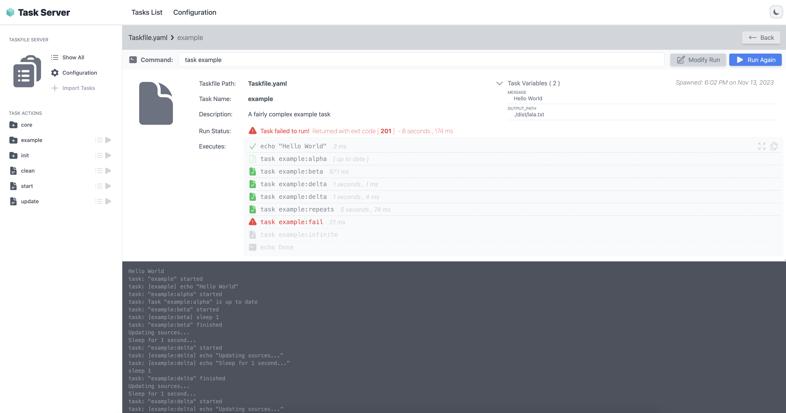
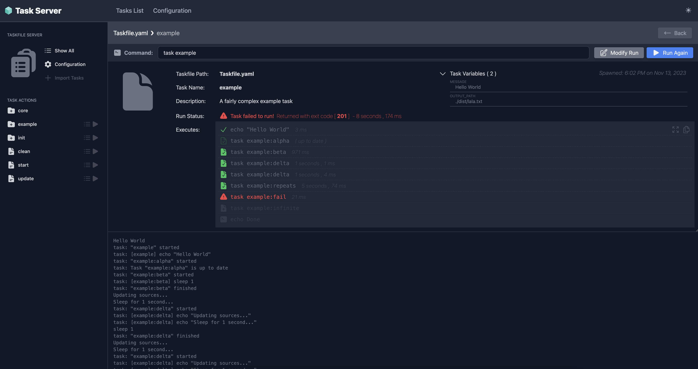
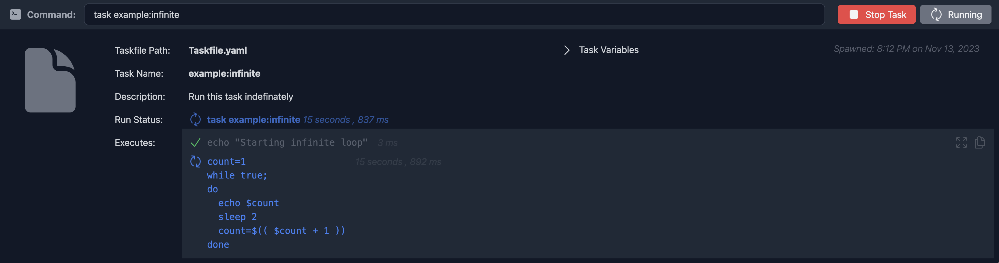
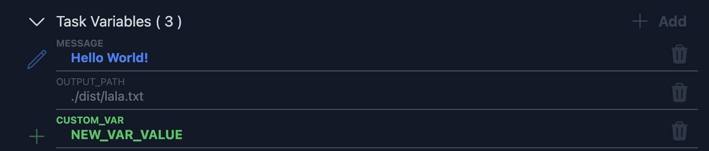
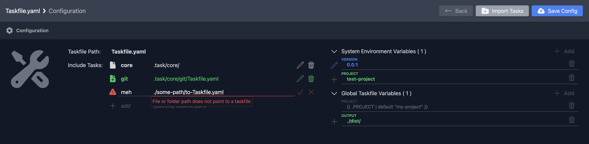
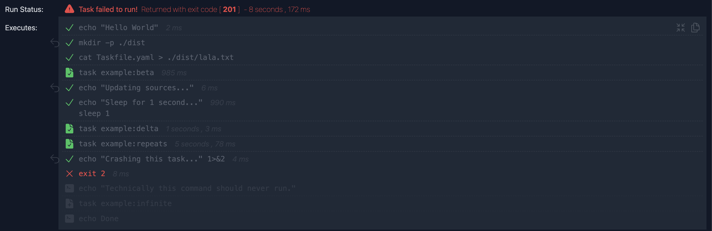

 
 <h1 align="center">Taskfile Server</h1>
 
Taskfile Server is a web application, to run and manage <a href="https://taskfile.dev/">Taskfile</a> automations.

  
    
    
    
    
  

  

    <a href="https://shiny-goggles-6xgx47v769f4974-9999.app.github.dev/taskserver">View Demo</a>
    ·
    <a href="https://github.com/planet-lodder/taskserver.py/issues">Report Bug</a>
  

> This project is heavily inspired by [Taskfile.dev](https://taskfile.dev/), and built on top of it's functionality.

## Features

Features include:

- a web user interface
- spawning and managing tasks
- modify task vars before run
- configurable taskfiles
- show execution path (with full drill down)

Features that are not included (yet):

- Authentication and Authorization of users (eg: local only)
- Multitenancy and user based run contexts, permissions
- Security hardening and Threat Analysis report(s)

### Web User Interface (with dark mode support)

We support both light and dark mode (auto detects from browser settings):

### Spawning and managing tasks

This project would be incomplete without the ability to spawn an actual task. To achieve this, we implemented a simple REST API that can handle invocations of tasks.

> Currently this is limited to the running context of the web server, so **should not be used in a production environment**. It works great as a local-only solution to manage tasks outside of the command line.

In a future release, we do envision implementing mechanisms to allow user permissions and context, but for now this is outside of the scope of the project.

### Extending task variables

You can add custom task variables, to be attached to a specific run. This enables you to supply user input to the underlying task.

### Configurable Taskfiles

Taskfiles can be viewed and modified (to some extent), with the focus being on:

- Adding or modifying task `includes`'s (with some validations).
- Setting or overriding default `Environment Variables`.
- Defining global `Taskfile Variables`.

### Showing execution breakdown

One nice feature we have is the ability to do a task execution breakdown. We use the `--dry` run feature of taskfile's, to plan out and parse the execution, before running it.

This has two advantages:

- For oversight: Know the commands you are about to execute...
- Track task execution: See where exactly the task fails, and for what reason.

## Motivation

Taskfile works well for automating all kinds of tasks. Some features include:

- It's declared in a simple, machine-readable file format (YAML).
- Task varibales make it easy to define defaults and overrides.
- We can use `includes`, making it composable / extensible.
- Task caching and run metadata make it efficient and fast.
- Good support for debugging, dry-run of tasks (with execution plans).

As your taskfile's become larger and more complicated, it becomes harder to manage and understand.

We try to tackle this problem by giving more advanced tooling around managing these task automations from a web interface, with the ability to track execution steps in near real time.
